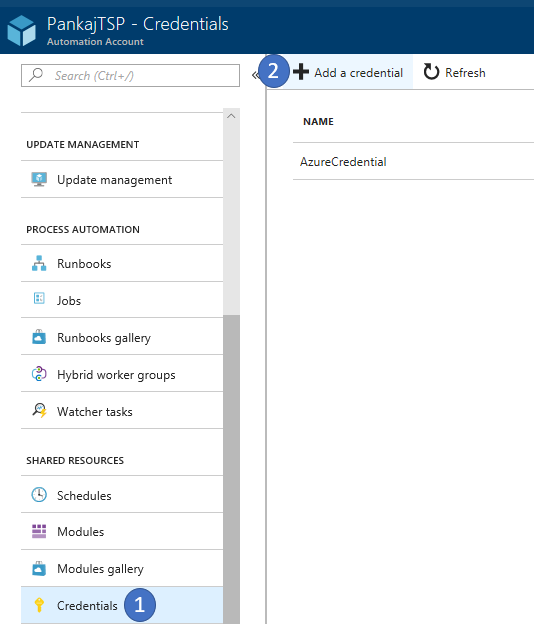
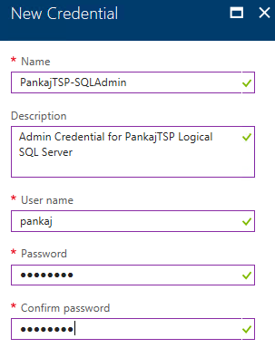
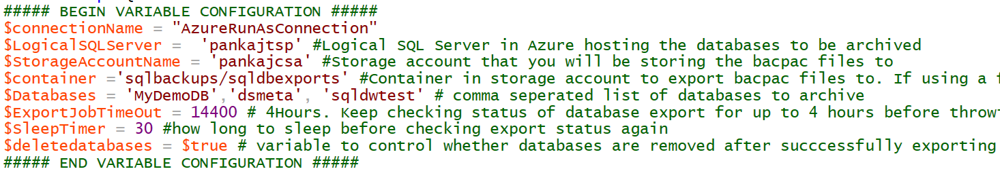
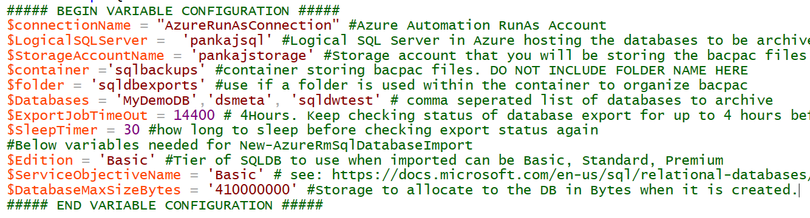
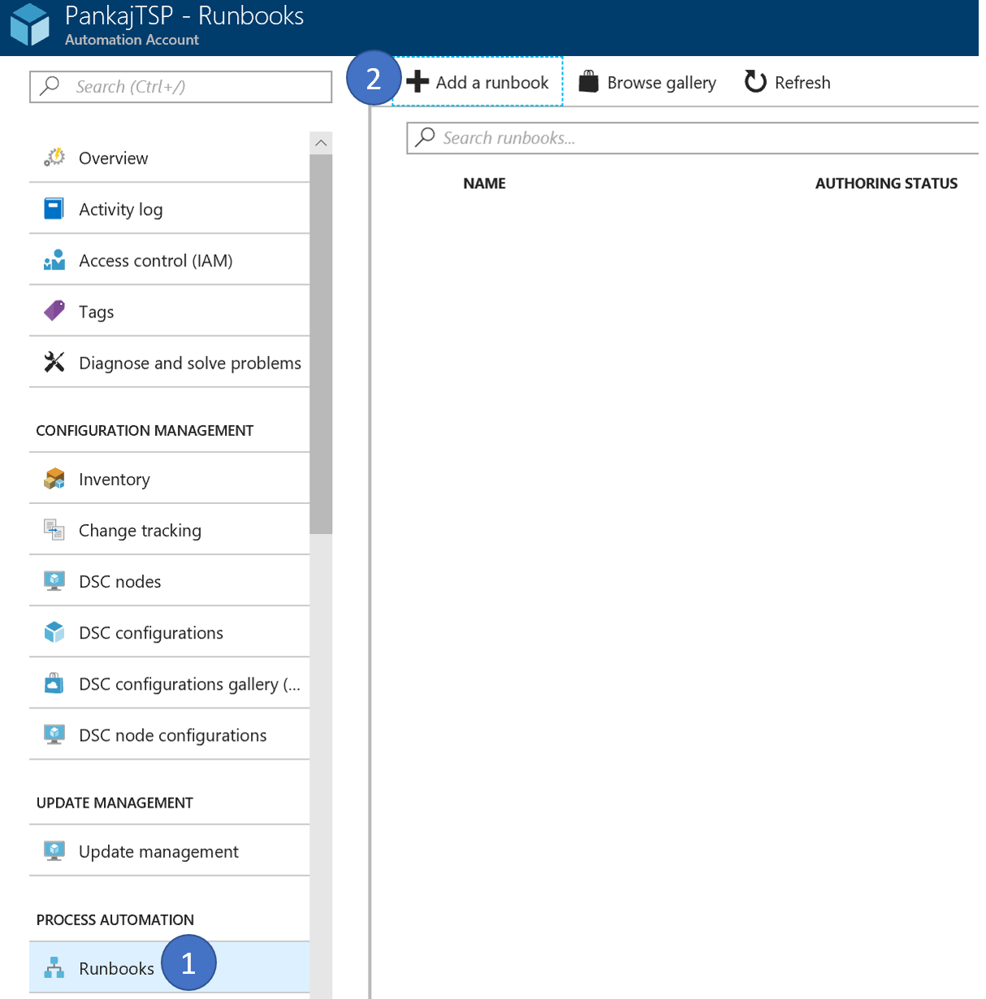
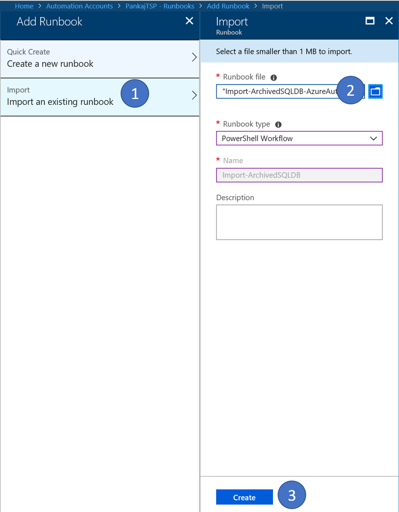

# Archive your SQLDB to BLOB and reimport on demand

If you were ever in need to archive SQL databases into blob storage as it was no longer needed for active development, but needed a process to ondemand be able to recover those databases, this guide will walk you thru end to end to create this solution. 

Technologies that will be leveraged:
  * Azure Automation
  * Azure Blob Storage
  * Azure SQLDB

## Pre-Requisites
This guide assumes that you have already created an Azure Automation Account, if not see this [link](https://docs.microsoft.com/en-us/azure/automation/automation-create-standalone-account) which will walk you thru creating an Azure Automation Account which by default also creates a RunAs account which has contributor access at the Subscription Level. If you wanted to add additional RunAs accounts see [Update your Automation account authentication with Run As accounts](https://docs.microsoft.com/en-us/azure/automation/automation-create-runas-account).

## Step 1) Create a Credential to connect to Azure SQLDB for use by Azure Automation
Open your Azure Automation account, (1) navigate to Credentials and (2) click <b>Add a credential</b> 

Fill in the name of your credential, Username used to connect to your AzureSQLDB Server that has admin access along with the password to authenticate with. 

## Step 2) Download the Runbooks
This solution leverages two PowerShell Workflow runbooks
 * <b>Archive-SQLDB-AzureAutomation.ps1</b>. This is used to export the databases to bacpac files on blob and optionally delete the DBs
 * <b>Import-ArchivedSQLDB-AzureAutomation.ps1</b>. This is used to reimport the bacpac on demand 

Download the two runbooks from the [powershell_workflows](https://github.com/pansaty/Archive-SQLDB-ReImport-OnDemand/tree/master/powershell_workflows) folder.

### Understanding Archive-SQLDB-AzureAutomation Runbook
This workflow takes a list of databases comma seperated and stored in the <b>$Databases</b> variable, loops thru and exports to storage. If the <b>$deletedatabases</b> variable is set to $true, the databases are deleted after being exported.

All variable configuration is done at the top of the script, and the variable names all have comments on the purpose. There should be no changes needed in the rest of the script for it to functionally work. You can however customize the rest of the script to meet the rest of your specific needs.

The general flow of the workflow is:
 * Set the variables
 * Login to Azure using the Azure Automation RunAs account
 * Get the credential needed to login into the Logical SQL Server hosting the databases to be archived
 * Confirm that the databases are online
 * Start and Export Job to export the database
 * Wait until export is completed
 * If $deletedatabases is set to $true and databases exported successfully, delete the database

### Understanding Import-ArchivedSQLDB-AzureAutomation Runbook
This workflow takes a list of databases comma seperated and stored in the <b>$Databases</b> variable, loops thru and imports from storage.

All variable configuration is done at the top of the script, and the variable names all have comments on the purpose. There should be no changes needed in the rest of the script for it to functionally work. You can however customize the rest of the script to meet the rest of your specific needs.

The general flow of the workflow is:
 * Set the variables
 * Login to Azure using the Azure Automation RunAs account
 * Get the credential needed to login into the Logical SQL Server hosting the databases to be archived
 * Confirm that a bacpac exists for the database, if multiple get the latest based on LastModified value of the blob
 * Confirm that there is not already a database on the Logical SQL Server with the same name as what you are trying to import
 * Start the Import job
 * Wait until import is completed

## Step 3) Importing the RunBooks
Within your Azure Automation account, navigate to (1) Runbooks then choose (2) Add Runbook

Next, choose (1) <b>Import an existing runbook</b> (2)Browse to the runbook files you downloaded in Step 2) (3) <b>Hit Create</b>

## Acknowledgements

 
