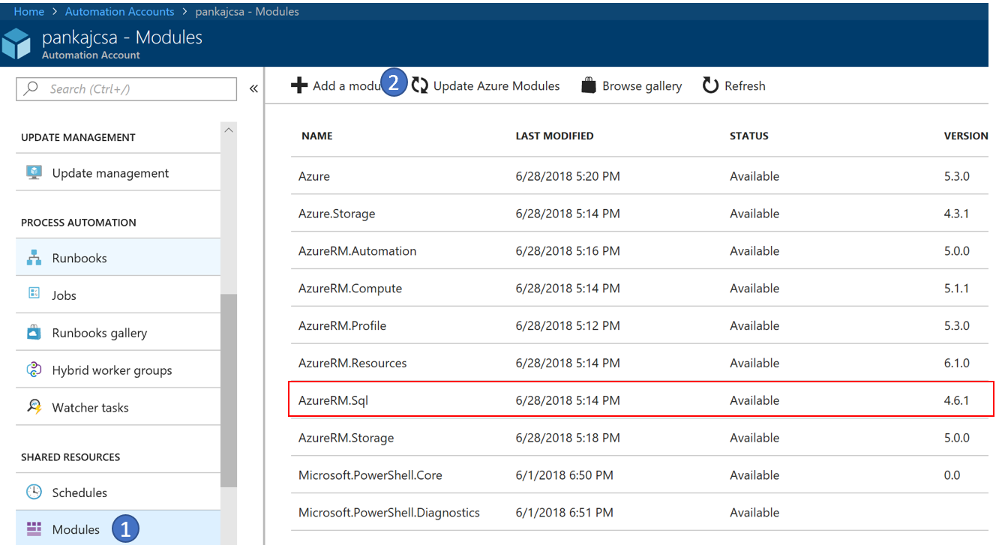
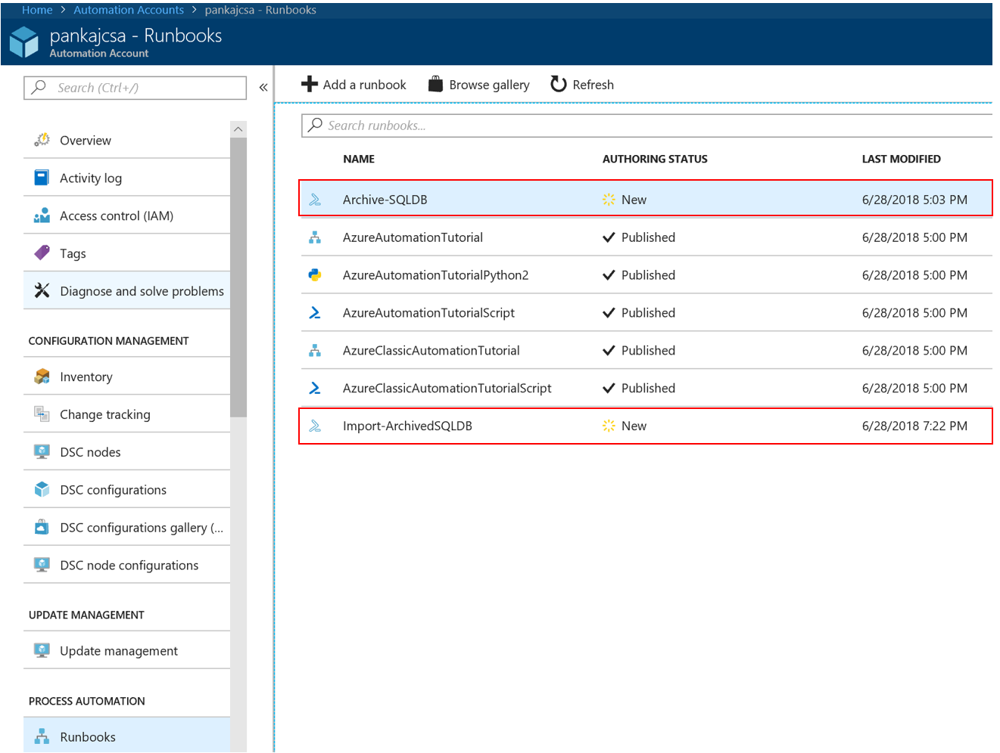
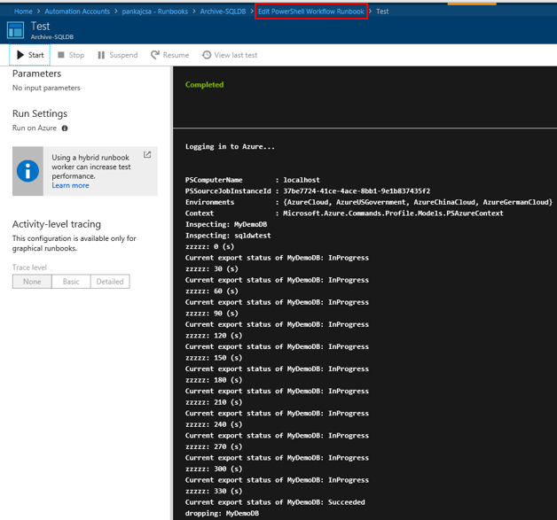

# Archive your SQLDB to BLOB and reimport on demand

If you were ever in need to archive SQL databases into blob storage as it was no longer needed for active development, but needed a process to ondemand be able to recover those databases, this guide will walk you thru end to end to create this solution. 

Technologies that will be leveraged:
  * Azure Automation
  * Azure Blob Storage
  * Azure SQLDB

## Pre-Requisites
This guide assumes that you have already created an Azure Automation Account, if not see this [link](https://docs.microsoft.com/en-us/azure/automation/automation-create-standalone-account) which will walk you thru creating an Azure Automation Account. By default this creates a RunAs account which has contributor access at the subscription Level. If you wanted to add additional RunAs accounts see [Update your Automation account authentication with Run As accounts](https://docs.microsoft.com/en-us/azure/automation/automation-create-runas-account).

## Step 1) Ensure you have the latest AzureRM.SQL module installed in your Automation Account
In your Azure Automation account, navigate to (1) Modules. Confirm that the AzureRM.SQL module is present and it is version 4.6.1 or higher. This script was tested on 4.6.1. 

If an older version of the module is present, select (2) <b>Update Azure Modules</b>. This may take several minutes.

If the AzureRM.Sql module is not present, select <b>Browse Gallery</b> and search for AzureRM.Sql, select then import. This may take several minutes. Once the import is completed, ensure that it is at version 4.6.1 or higher, if not follow the previous steps to update the Azure modules. 

## Step 2) Create a Credential to connect to Azure SQLDB for use by Azure Automation
Open your Azure Automation account, (1) navigate to Credentials and (2) click <b>Add a credential</b> 

Fill in the name of your credential, Username used to connect to your AzureSQLDB Server that has admin access along with the password. 

## Step 3) Download the Runbooks
This solution leverages two PowerShell Workflow runbooks
 * <b>Archive-SQLDB-AzureAutomation.ps1</b>. This is used to export the databases to bacpac files on blob and optionally delete the DBs
 * <b>Import-ArchivedSQLDB-AzureAutomation.ps1</b>. This is used to reimport the bacpac on demand 

Download the two runbooks from the [powershell_workflows](https://github.com/pansaty/Archive-SQLDB-ReImport-OnDemand/tree/master/powershell_workflows) folder.

You will need to modify the top section of each script marked by <b>###### BEGIN VARIABLE CONFIGURATION  #####</b>

### Understanding Archive-SQLDB-AzureAutomation Runbook
This workflow takes a list of databases comma seperated and stored in the <b>$Databases</b> variable, loops thru and exports to storage. If the <b>$deletedatabases</b> variable is set to $true, the databases are deleted after being exported.

All variable configuration is done at the top of the script, and the variable names all have comments on the purpose. There should be no changes needed in the rest of the script for it to functionally work. You can however customize the rest of the script to meet the rest of your specific needs.

The general flow of the workflow is:
 * Set the variables
 * Login to Azure using the Azure Automation RunAs account
 * Get the credential needed to login into the Logical SQL Server hosting the databases to be archived
 * Confirm that the databases are online
 * Start an Export Job to export the database
 * Wait until export is completed
 * If $deletedatabases is set to $true and databases exported successfully, delete the database

### Understanding Import-ArchivedSQLDB-AzureAutomation Runbook
This workflow takes a list of databases comma seperated and stored in the <b>$Databases</b> variable, loops thru and imports from storage.

All variable configuration is done at the top of the script, and the variable names all have comments on the purpose. There should be no changes needed in the rest of the script for it to functionally work. You can however customize the rest of the script to meet the rest of your specific needs.

The general flow of the workflow is:
 * Set the variables
 * Login to Azure using the Azure Automation RunAs account
 * Get the credential needed to login into the Logical SQL Server hosting the databases to be archived
 * Confirm that a bacpac exists for the database, if multiple get the latest based on LastModified value of the blob
 * Confirm that there is not already a database on the Logical SQL Server with the same name as what you are trying to import
 * Start the Import job
 * Wait until import is completed

## Step 4) Importing the RunBooks
Within your Azure Automation account, navigate to (1) Runbooks then choose (2) Add Runbook

Next, choose (1) <b>Import an existing runbook</b> (2)Browse to the runbook files you downloaded in Step 3) (3) <b>Hit Create</b>. You would need to do this once for each of the runbook files you downloaded.

## Step 5) Publish and Run the Runbooks
At this point you are all set to run the Runbooks manually, or schedule it to run. In your Azure Automation account, navigate to Runbooks and confirm that you see both the Runbooks that you imported, <b>Archive-SQLDB</b> and <b>Import-ArchiveSQLDB</b>

Select the Archive-SQLDB runbook. You will be unable to select <b>Start</b> or <b>View</b> as the runbook has not yet been published. Click on <b>Edit</b>. Before publishing, let's test the runbook by selecting <b>Test Pane</b>. In the Test Pane, select <b>Start</b>. You should see the output from the runbook in the right pane. This will take several minutes to run and if all variable parameters were set correctly, should complete without errors.

At this point you are ready to publish the Archive-SQLDB runbook. Navigate back to <b>Edit PowerShell Workflow Runbook</b> in the breadcrumbs as highlighted in the above screen shot. In the Edit View, go ahead and select <b>Publish</b>. Your runbook is now ready to be scheduled or run on demand. For details on setting up a schedule see [here](https://docs.microsoft.com/en-us/azure/automation/automation-schedules#creating-a-schedule).

Repeat the same procedure for the <b>Import-ArchiveSQLDB</b> runbook. 

 
